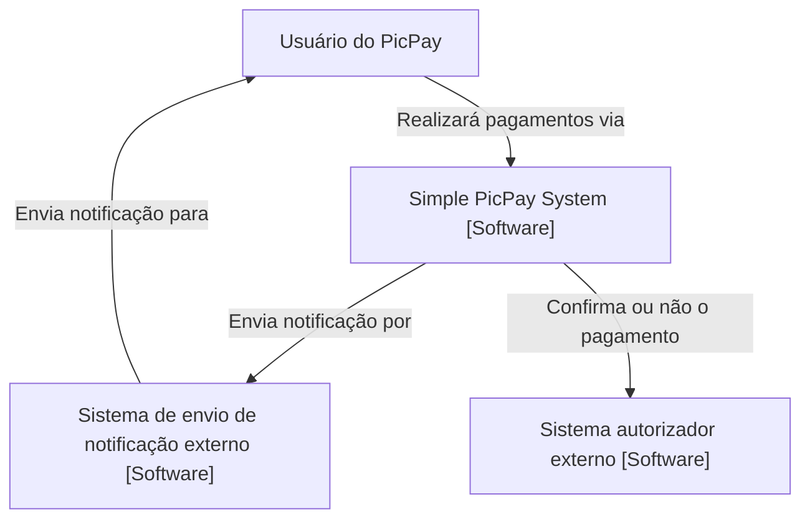

# 🚀 Plataforma de Pagamentos - Desafio Back End

Este repositório contém a solução para o desafio back end de uma plataforma de pagamentos. O projeto foi desenvolvido utilizando **Spring Boot**, **Spring Data JPA**, **Docker**, **Docker Compose** e **MySQL**. Também foram criados diagramas de arquitetura para melhor compreensão da solução.

## 🛠️ Tecnologias Utilizadas

- **Spring Boot**: 🚀 Framework principal para desenvolvimento do aplicativo.
- **Spring Data JPA**: 📊 Utilizado para persistência de dados.
- **Docker**: 🐳 Ferramenta de containerização para empacotar a aplicação.
- **Docker Compose**: 📦 Utilizado para orquestrar containers Docker.
- **MySQL**: 🗄️ Banco de dados relacional

## 🔍 Documentação da API com Swagger
A API possui documentação interativa gerada pelo Swagger, que facilita a visualização e teste dos endpoints.

Acesso à Documentação
Após iniciar a aplicação, acesse http://localhost:8080/swagger-ui.html para visualizar a documentação da API.

## ⚙️ Configuração do Projeto

### Pré-requisitos

- Docker instalado
- Docker Compose instalado
- Java 11 ou superior
- Maven instalado

### Instruções para Executar o Projeto

1. Clone este repositório:
    ```sh
    git clone https://github.com/Fioshi/picpay-simp.git
    ```

2. Configure o arquivo `application.properties` com as informações necessárias para conexão com o banco de dados.

3. Compile o projeto:
    ```sh
    mvn clean install
    ```

4. Execute a aplicação utilizando Docker Compose:
    ```sh
    docker-compose up --build
    ```

5. A aplicação estará disponível em [http://localhost:8080](http://localhost:8080).

## 📊 Diagrama de Arquitetura

### Diagrama de Contexto


### Diagrama de Container
```mermaid
graph TD;
    User[Usuário do projeto];
    BackendAPI["API de Backend (Java + Springboot)"];
    Database["Banco de Dados (MySQL)"];
    EmailSystem["Sistema de envio de notificação por e-mail"];
    AuthSystem["Sistema de autenticação"];

    User -->|Requisição HTTP| BackendAPI;
    BackendAPI -->|📧 Envia notificação usando| EmailSystem;
    BackendAPI -->|🔐 Verifica pagamento usando| AuthSystem;
    Database -.->|📂 Persiste e retorna dados| BackendAPI;
````

### Diagrama de Component
```mermaid
graph TD
    User[Usuário do PicPay] -->|Solicitações HTTP| AccountController
    User -->|Solicitações HTTP| UserController
    User -->|Solicitações HTTP| PaymentController

    AccountController[Account Controller] -->|Chama para processar dados| AccountService
    UserController[User Controller] -->|Chama para processar dados| UserService
    PaymentController[Payment Controller] -->|Chama para processar dados| PaymentService

    AccountService[Account Service] -->|Chama para persistir e recuperar dados| AccountRepository
    UserService[User Service] -->|Chama para persistir e recuperar dados| UserRepository
    PaymentService[Payment Service] -->|Chama para persistir e recuperar dados| PaymentRepository
    PaymentService -->|Envia pedido de autorização| ExternalAuthorizationSystem
    PaymentService -->|Envia pedido de notificação| ExternalNotificationSystem

    AccountRepository[Account Repository] -->|Persistência| Database[MySQL Database]
    UserRepository[User Repository] -->|Persistência| Database[MySQL Database]
    PaymentRepository[Payment Repository] -->|Persistência| Database[MySQL Database]

    PaymentService --> PaymentValidators[Payment Validators]

    ExternalNotificationSystem[Sistema de Envio de Notificação Externo]
    ExternalAuthorizationSystem[Sistema Autorizador Externo]

    subgraph API Backend [Java e Spring Boot]
        AccountController
        UserController
        PaymentController
        AccountService
        UserService
        PaymentService
        AccountRepository
        UserRepository
        PaymentRepository
    end

    subgraph DatabaseSystem [Sistema de Banco de Dados]
        Database
    end

    subgraph ExternalSystems [Sistemas Externos]
        ExternalNotificationSystem
        ExternalAuthorizationSystem
    end
```

## 🔗 Endpoints

A aplicação possui os seguintes endpoints disponíveis:

- `POST /user`: Criação de um novo usuário e conta.
- `POST /pagamentos`: Realização de um pagamento.
- `GET /pagamentos/{payee}`: Obtenção de informações de um pelo recebedor do dinhero.
- `GET /pagamentos/{payer}`: Obtenção de informações de um pagamento pelo pagador.
